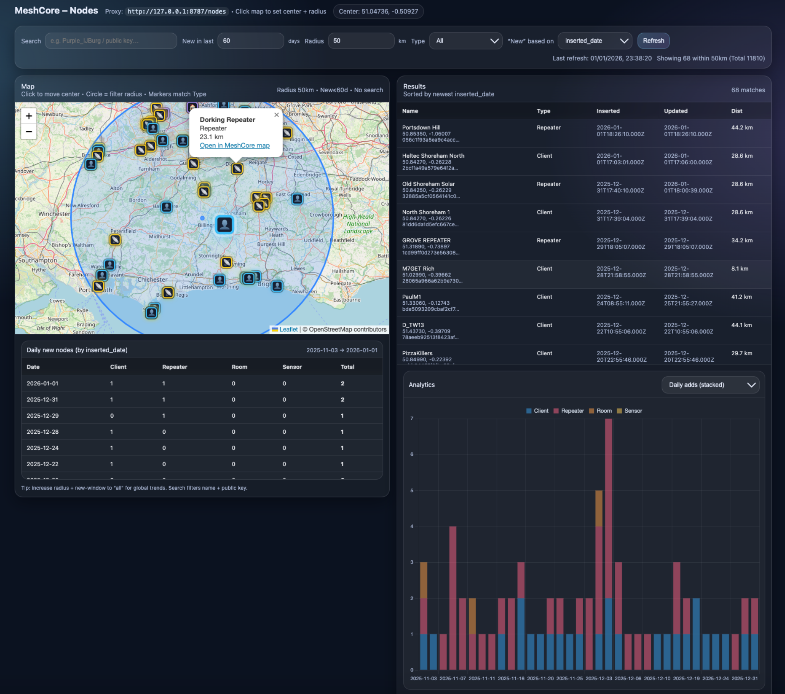

# MeshCore Nodes Dashboard

> ⚠️ **Disclaimer**  
> This is **not an official MeshCore project**.  
> It is an independent, community-built dashboard created to explore and analyse MeshCore data.

An interactive, map-centric analytics dashboard for exploring the MeshCore network.  
This project provides rich geospatial exploration, filtering, analytics, and performance‑aware caching on top of the MeshCore `/nodes` endpoint.



---

## ✨ Features

### 🌍 Map & Geospatial Exploration
- Interactive Leaflet map of MeshCore nodes with GPS data
- Click anywhere on the map to set a **centre point**
- Radius-based filtering with a visible distance circle
- Zoom behaviour anchored to the selected centre
- Smooth pan/zoom for intuitive exploration

### 📡 Node Types & Visual Encoding
- Supports all MeshCore node types:
  - Client
  - Repeater
  - Room Server
  - Sensor
- High‑contrast, compact markers optimised for dark map tiles
- Colour‑coded and emoji‑based icons for rapid identification

### 🔎 Filtering & Search
- Search by node name or public key
- Filter by:
  - Radius (km)
  - Node type
  - “New in last X days”
  - Basis for “new” (inserted date or first seen)
- Instant UI updates using cached data

### 📊 Analytics
- Built‑in analytics with a chart selector (only one chart rendered at a time for performance):
  - Daily node additions (stacked by type)
  - Cumulative growth
  - Moving average of daily additions
  - Node type distribution
  - Distance distribution from centre
  - Node freshness / last‑seen buckets
- Charts dynamically respond to filters and map centre

### 📋 Results Table
- Detailed table of matching nodes including:
  - Name
  - Type
  - Inserted date
  - Updated / last‑seen timestamp
  - Distance from centre
- Sorted by newest nodes
- Hovering a row highlights the node on the map

### ⚡ Performance & Caching
- Full in‑browser cache of **all nodes returned by MeshCore**
- Cache TTL: **5 minutes**
- Searches, filters, map interaction and analytics do **not** hit the backend
- Backend is queried only:
  - On initial load
  - When cache expires
  - When Refresh is clicked
- Designed to minimise load on the central MeshCore backend

### 🕒 Data Freshness
- Status display showing:
  - Number of matching nodes
  - Active radius
  - Total nodes in the dataset
- Top‑right indicator showing **last refresh date/time**

---


## 🧱 Architecture

- Pure client‑side frontend (HTML + JavaScript)
- Uses Leaflet and Chart.js
- Reads from the MeshCore `/nodes` snapshot endpoint via a proxy
- No framework dependencies
- Suitable for localhost use or static hosting
- Ready for future extensions (events, stats, topology)

---

## 🚀 Getting Started (Local)

1. Run a MeshCore proxy locally (example):
   ```
   http://127.0.0.1:8787/nodes
   ```
2. Open the HTML file in a browser:
   ```
   meshcore-nodes.html
   ```
3. Explore the network using the map, filters and analytics.

---

## 🧭 Status

This project is actively evolving and already being used for real‑world MeshCore network exploration.  
Contributions, feedback and ideas are welcome.

---

## 📜 License

This project is licensed under the **MIT License**.

## 🙏 Acknowledgements

Huge thanks to the **MeshCore team** for all the work behind the MeshCore network and platform.

MeshCore project: https://meshcore.co.uk
